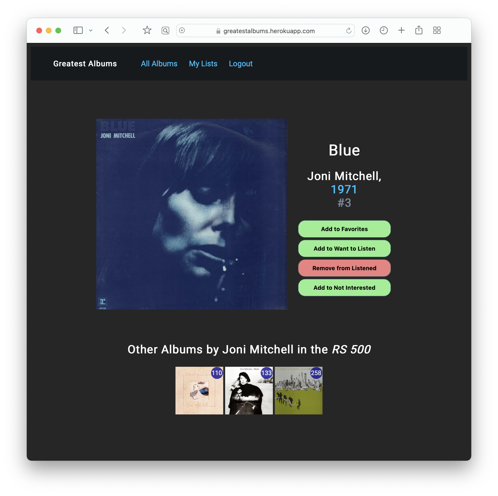

# Greatest Albums

## About
Greatest Albums is an app where users can explore *Rolling Stone*’s [2020 list](https://www.rollingstone.com/music/music-lists/best-albums-of-all-time-1062063/) of the 500 Greatest Albums of All Time. You can check out the app [here](https://greatestalbums.herokuapp.com).

As a user, you can browse all albums; see album details, including other albums by the artist featured on the RS list; and save an album to your "favorites," "want to listen," "listened," or "not interested" list. You can also filter albums by decade or year, or see only albums that you haven't yet added to your lists.

**Technologies Used**: Django, PostgreSQL, Heroku, AWS

The user interface design is inspired by [Letterboxd](https://letterboxd.com) and [Musicboard](https://musicboard.app). Another inspiration is [The Greatest Books](https://thegreatestbooks.org).

## Screenshots

## Getting Started / Contribution Guidelines
You can use the app by clicking [here](https://greatestalbums.herokuapp.com).

If you'd like to contribute to the app, you can fork and clone this repo, make changes, and submit a pull request. If you notice a bug or want to propose an idea for improving the app, you can submit it as an issue to this repo.

## Development Roadmap
- [x] Album index, album detail
- [x] Filter album index by decade, year
- [x] User accounts; add album to my lists
- [x] Album detail: Other albums by artist
- [x] Filter out albums in user lists
- [ ] "Comfy" view in album index
- [ ] Switch to rankings from RS's 2003 or 2012 list
- [ ] Sort albums by date
- [ ] Search albums by title/artist
- [ ] Organize CSS with Sass
- [ ] Signup/login with Google/Apple/Facebook